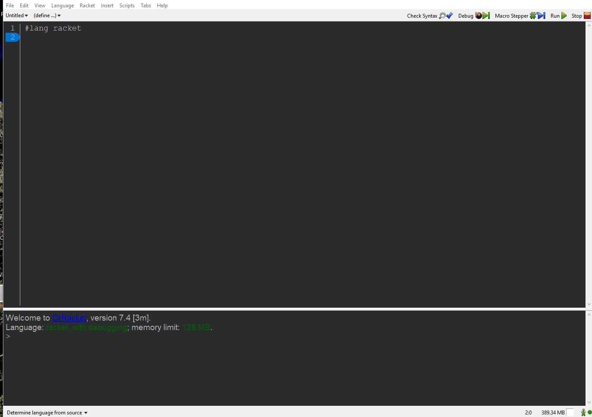

# FSM
##### FSM Library Version 1.0
A Library for the Automata Theory Classroom


## Installation
There are two ways to install fsm onto your machine.

### Using Raco

```bash
raco pkg install https://github.com/morazanm/fsm.git
```

### Using Racket's Package Manager



Once fsm is installed just require the module. 
```racket
(require fsm)
```


## Basic Usage
Below are some basic examples of how to use fsm. For a more in-depth guide please visit the [fsm documentation](https://htmlpreview.github.io/?https://github.com/morazanm/fsm/blob/master/doc/fsm/index.html).

#### Building a DFA
```racket
(require fsm)

(define a* (make-dfa '(S F)     ;; the states
                     '(a b)     ;; the input alphabet
                     'S         ;; the staring state
                     '(F)       ;; the set of final states
                     '((S a F)  ;; the transition functions
                       (F a F)
                       (F b F))))
```

#### Building a NDFA
```racket
(require fsm)

(define a* (make-ndfa '(S F)     ;; the states
                      '(a b)     ;; the input alphabet
                      'S         ;; the set of final states
                      '(F)       ;; the transition functions
                      '((S a F)
                        (F a F)
                        (F b F))))
```
#### Building a PDA
```racket
(require fsm)

(define M4 (make-ndpda '(S M F)
                        '(a b)
                        '(a b)
                        'S
                        '(F)
                        `(((S ,EMP ,EMP) (M ,EMP))
                          ((M ,EMP ,EMP) (F ,EMP))
                          ((M a ,EMP) (M (a)))
                          ((M b ,EMP) (M (b)))
                          ((M a (b)) (M ,EMP))
                          ((M b (a)) (M ,EMP)))))
```


#### Visualizing a Machine 
To visualize a dfa, ndfa, or pda create a new file and require fsm. Then type the following before running the file. The below can also be typed in the cmd.

1) sm-visualize &lt;machine-type&gt; To visualize a machine from scratch.
```racket
(sm-visualize 'pda) ;; Where the machine type is a symbol
```

2) sm-visualize &lt;pre-built-machine&gt; To visualize a pre-built machine.
```racket
(sm-visualize a*) ;; See "Building a DFA" for the implementation of a*
```

3) sm-visualize &lt;pre-built-machine '(state invariant-function)&gt; To visualize a pre-built machine with associated state invariants.
```racket
;; dummy invariant functions
(define INV1 (lambda (v) true))
(define INV2 (lambda (v) false))

;; Visualize the machine 
(sm-visualize a* () (list 'S INV1) (list 'F INV2))
```

## Future Additions
- Extend the visualization tool to work for turing machines

## Acknowledgements
TODO: Add acknowledgements here

## Authors
Written by: Marco T. Morazan and Rosario Antunez, 2015

## License
Copyright (C) 2015 by Marco T. Morazan and Rosario Antunez
