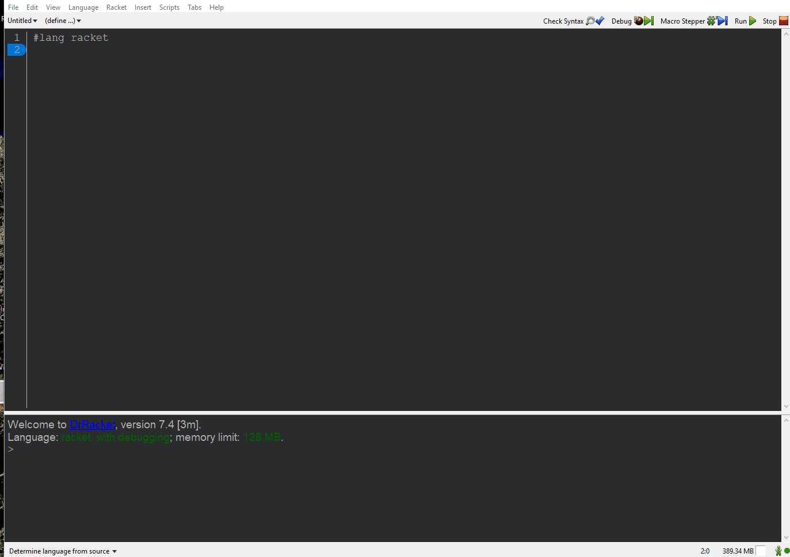

# Installing FSM
FSM can be installed by using any of the below options.

## Using Raco

```bash
raco pkg install https://github.com/morazanm/fsm.git
```


## Using DrRacket's Package Manager



## Local Installation (Contributors only)
If you are installing `fsm` because you want to contribute to the project all you have to do is clone the repo. 
```shell
git clone https://github.com/morazanm/fsm.git
```
Before creating a pull request please checkout the [Contribution Guidelines](contribute.md).
